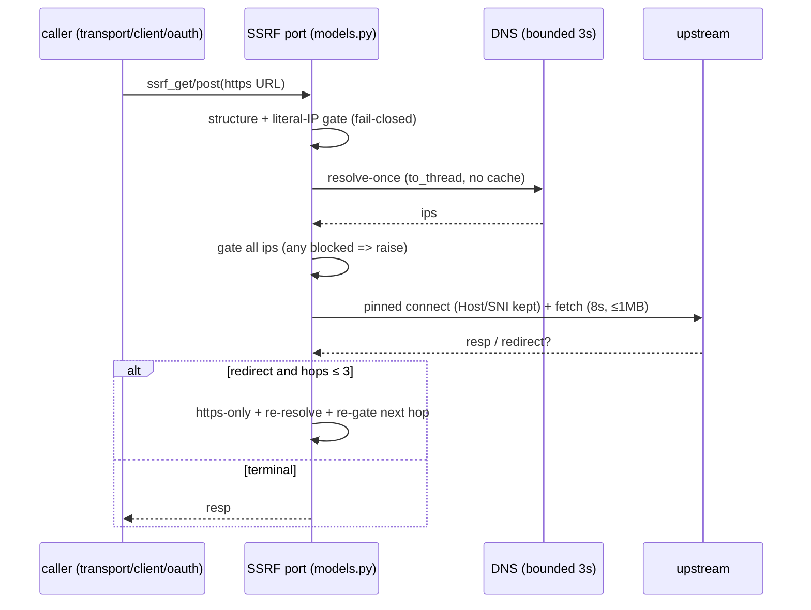

# ADR-011: SSRF Hardening for Remote Gateway Fetches

## Status

Accepted (implemented: SSRF port in `models.py`, consumers in `transport.py`/`client.py`/`oauth.py`, limits in `gateway.py`; verified by AC-01..AC-10)

## Context

Remote `type: remote` URLs are attacker-influenced input (server registry, OAuth discovery, transport probes).
A naive `httpx` fetch is vulnerable to classic SSRF classes:

- **P0-1 — Literal-IP bypasses:** decimal/hex/octal/partial IPv4 (`2130706433`, `0x7f.0.0.1`,
  `0177.0.0.1`, `127.1`), IPv4-mapped IPv6 (`::ffff:127.0.0.1`) slipping past a
  string-prefix blocklist.
- **P0-2 — DNS rebinding / TOCTOU:** validate-at-add-time passes on a benign A record,
  connect-time resolves to `169.254.x.x` / `10/8` / loopback. Any validate-then-fetch
  split without pinning is racy.
- **P0-3 — Redirect escape:** auto-follow redirects (`follow_redirects=True`) hops from a
  public URL to `http://169.254.169.254/` or downgrades `https → http` without re-validation.
- **P0-4 — Unbounded fetch:** no timeout / no body cap turns the gateway into an
  amplification + memory-exhaustion oracle.
- **P0-5 — Event-loop blocking:** sync `socket.getaddrinfo` on the loop stalls all
  sessions under a slow resolver.

Prior state already contains the hardened implementation (`models.py:24-586`,
`core/transport.py`, `core/client.py`, `oauth.py`, `gateway.py`); this ADR records
the decision, the rejected alternatives, and the 1:1 acceptance ↔ test mapping the
DoD gate requires. It builds on ADR-009 (local allow-list, `MCP_GWAY_*` names frozen)
and ADR-010 (unified `serve`; remote fetches ride the same `Gateway.app`).

Related: ADR-009 (dynamic local commands), ADR-010 (unified serve).

## Decision — Option A (adopted): resolve-once + pin + https-only + manual redirects + bounded port

Single SSRF port owned by `src/mcp_gway/models.py`; every remote path goes through it:

1. **Structure gate (pure, no I/O)** — `_validate_url_structure` (`models.py:226-241`):
   `http|https` scheme only, no CR/LF, no userinfo (`@`), no encoded/backslash/space host,
   IDNA + lowercase + strip-trailing-dot, `localhost` / `*.localhost` rejected
   fail-closed with `[reason=...]` tokens.
2. **Literal-IP gate (no DNS)** — `_ensure_literal_ip` (`models.py:244-260`) canonicalizes
   legacy forms (`_legacy_ipv4_to_canonical`, `models.py:138-174`) then blocks
   loopback/private/link-local/multicast/reserved/unspecified incl. mapped IPv6.
   Non-literals return `False` → DNS path is mandatory, never skipped.
3. **Bounded async DNS gate** — `_aresolve_host_ips` (`models.py:314-325`): `to_thread`
   + 3 s timeout (`SSRF_DNS_TIMEOUT`), `use_cache=False` on the hot path; empty /
   zero-parsable / any-blocked-IP → `ValueError` fail-closed (`_ensure_resolved_ips`,
   `models.py:263-279`).
4. **Resolve-once + pin per hop** — `_send_pinned` (`models.py:486-510`) resolves, gates,
   then holds `_pinned_dns` (async per-loop lock + process-global `getaddrinfo` patch,
   `models.py:403-415`) for the whole connect so validate-IP == connect-IP.
   URL keeps the hostname → Host/SNI preserved.
5. **https-only + manual redirects, max 3** — `_ssrf_fetch` (`models.py:528-571`):
   entry scheme must be `https` (`[reason=https_only]`); `follow_redirects=False` always;
   each hop re-validated + re-pinned via `_aresolve_redirect_target`
   (`models.py:467-483`); non-`https` target, empty `Location`, or hop ≥ 3 →
   `[reason=redirect]`.
6. **Bounded port** — one client factory `make_ssrf_http_client` (`models.py:513-525`):
   `timeout=8.0 s` (`SSRF_TIMEOUT`), `follow_redirects=False`; 1 MB cap via
   content-length pre-check + body length (`_ensure_body_limits`, `models.py:429-447`).
   Public surface: `ssrf_get` / `ssrf_post` only.
7. **Consumers (no second fetch path):**
   - Model validator `MCPServerConfig.validate_url` → `validate_url_ssrf`
     (`models.py:638-643`) — add-time sync gate (cached DNS).
   - Transport probes `_ssrf_gate` + pinned `streamable_http`/`sse`/`ssrf_post`
     (`core/transport.py:12-171`) — probes return `False` on gate miss, never raise.
   - Session transport `_create_remote_transport` (`core/client.py:85-252`) — async gate
     + re-resolve + `_pinned_dns` around the SDK client (`SSRF_TIMEOUT`,
     `follow_redirects=False` via explicit `httpx2.AsyncClient` / factory).
   - OAuth discovery + token flow via `ssrf_get`/`ssrf_post` + `avalidate_url_ssrf`
     (`oauth.py:302-458`); gateway SSE limits reuse `SSRF_MAX_BODY` /
     `SSRF_IDLE_TIMEOUT` (`gateway.py:20,60-63,292`).

### Principles honored

- **SoC / Dependency Inversion:** domain (`models.py`) owns the SSRF port; infra
  (`transport.py`, `client.py`, `oauth.py`) depends on the abstraction
  (`ssrf_get/post`, `avalidate_url_ssrf`), never raw `httpx`.
- **Fail Fast / Fail-Closed:** every rejection raises `ValueError` with a
  `[reason=...]` token; probes map it to `False`, never to a fallback fetch.
- **KISS + YAGNI:** one client factory, one fetch loop, no allow-list service, no
  egress proxy — deferred until a bounded context earns it.
- **Composition over Inheritance:** `_ssrf_gate`, `_send_pinned`, `_pinned_dns` compose;
  no fetcher hierarchy.
- **DoC:** each gate documents its WHY narrow/broad exception rationale inline.

### DSA / complexity

| Operation | Structure | Cost | Note |
|---|---|---|---|
| Literal-IP check | pure parse + `ipaddress` | O(1), no I/O | hot path, no alloc beyond parse |
| DNS resolve | `getaddrinfo` in `to_thread`, dedup list | O(k) addrs, ≤ 3 s bounded | `use_cache=False` on fetch path kills stale-pin class |
| Pin hold | per-loop `asyncio.Lock` + global patch | O(1) lock, serializes pin+connect per hop | concurrent hosts isolated (pin-isolation tests); throughput cost accepted — correctness > parallelism |
| Redirect loop | bounded `for hop in range(4)` | O(1) hops | no unbounded chain |
| Body cap | header pre-check + `len(content)` | O(1) | streaming callers must enforce incrementally |

No new data structure is introduced; the only shared state is the sync `_SSRF_DNS_CACHE`
(`models.py:36`, 60 s TTL) used **only** by the sync add-time validator, never by the
fetch path.

## Alternatives Considered

- **Option B — Validate-once at `add`/`refresh`, plain fetch at runtime: REJECTED.**
  Pros: simplest, no pin/lock, fastest probes. Cons: TOCTOU/DNS-rebinding wide open
  (validate-IP ≠ connect-IP); redirects never re-checked; fails P0-2/P0-3 outright.
  A TTL cache on validated hosts makes it worse (stale allow). Rejected: speed cannot
  buy a known SSRF hole.
- **Option C — Egress proxy / allow-list service + plain HTTP allowed: REJECTED.**
  Pros: central policy, audit point, could permit `http://` intranet remotes.
  Cons: new networked dependency + ops burden + latency on every hop; contradicts
  local-first headless stance and YAGNI (no intranet-remote requirement exists);
  `http://` downgrades re-open sniffing/redirect classes the https-only rule kills.
  Rejected: buys governance we don't need at the price of distributed-system tax
  (cf. ADR-010 guidance: don't pay it on day one). Revisit only if a bounded context
  earns independent egress policy.

## Consequences

- **Breaking (accepted): `https-only`.** `http://` remotes fail with
  `ssrf: https-only [reason=https_only]` at model validation, `detect_transport`,
  `_create_remote_transport`, and `_ssrf_fetch`. Operators must terminate TLS or stay
  `type: local`. This is the intended P0 posture, not a regression.
- **Private/loopback/link-local targets always blocked**, including
  numeric/hex/octal/mapped forms and DNS-resolved privates, at add-time AND fetch-time.
- **Redirects are manual, max 3, https-only, re-pinned per hop.** SDK auto-redirects
  are force-disabled (`follow_redirects=False` in every factory).
- **Bounded:** 8 s fetch timeout, 3 s DNS timeout, 1 MB body cap, 60 s sync-validator
  DNS cache only. Slow resolvers/upstreams fail closed, never hang the loop.
- **Concurrency:** pin+connect serialized per loop by `_get_pin_lock`; overlapping
  hosts stay isolated (no cross-host pin leak) at the cost of per-hop serialization.
- **HARD intact (non-negotiable):** `serve` still binds `127.0.0.1` by default
  (non-loopback without `MCP_GWAY_ALLOW_REMOTE=1` → exit 2); `MCP_GWAY_ALLOW_LOCAL_COMMANDS`
  / `MCP_GWAY_ALLOW_UNRESTRICTED_LOCAL` / `MCP_GWAY_ALLOW_LOCAL_VIA_DASHBOARD` names
  unchanged (ADR-009); this ADR is **docs-only, no prod code**.

## Traces

- `src/mcp_gway/models.py:24-36` (SSRF constants), `:226-347` (structure/literal/DNS
  gates), `:351-423` (pin helpers), `:425-483` (body + redirect gates), `:486-586`
  (`_send_pinned`, client factory, `_ssrf_fetch`, `ssrf_get/post`), `:638-643` (model validator)
- `src/mcp_gway/core/transport.py:12-171` (`_ssrf_gate`, pinned probes, `detect_transport`)
- `src/mcp_gway/core/client.py:85-252` (`_create_remote_transport`: gate + pin + bounded httpx)
- `src/mcp_gway/oauth.py:302-458` (discovery + flow via SSRF port)
- `src/mcp_gway/gateway.py:20,60-63,292` (SSE body/idle limits reuse)

## Acceptance Criteria (1:1 ↔ tests; TDD red → green → refactor)

Every criterion below is an executable test. Red = gate missing/bypassed (fetch hits
private/rebound/plain-http/unbounded); Green = minimal gate above flips it;
Refactor target = keep the single SSRF port (no second fetch path).

- **AC-01 Literal-IP bypasses blocked** ↔ `tests/test_models_ssrf.py::test_numeric_int_bypass_blocked`,
  `::test_hex_bypass_blocked`, `::test_octal_bypass_blocked`, `::test_ipv4_mapped_ipv6_blocked`,
  `::test_model_rejects_numeric_bypass` (+ `::test_validate_url_ssrf_helper_exists`,
  `::test_no_pytest_env_branch_in_models` guardrails).
- **AC-02 Loopback/hostnames blocked** ↔ `tests/test_models_ssrf.py::test_localhost_blocked_even_under_pytest`.
- **AC-03 DNS rebinding blocked (validate-IP == connect-IP)** ↔
  `tests/test_models_ssrf.py::test_dns_rebinding_blocked_via_getaddrinfo`,
  `::test_public_url_allows_with_stubbed_dns` (negative leg: public still passes).
- **AC-04 https-only entry** ↔ `tests/test_oauth_ssrf.py::test_ssrf_get_https_only`,
  `::test_ssrf_post_https_only`; producers: `tests/test_transport_client_ssrf.py::test_transport_validates_ssrf`,
  `::test_client_validates_ssrf`.
- **AC-05 Private IP blocked at fetch** ↔ `tests/test_oauth_ssrf.py::test_ssrf_get_blocks_private_ip`.
- **AC-06 Redirects manual + re-validated (https-only, ≤ 3, re-pinned)** ↔
  `tests/test_oauth_ssrf.py::test_ssrf_get_manual_redirect_revalidated`.
- **AC-07 Bounded fetch (1 MB cap + 8 s timeout)** ↔
  `tests/test_oauth_ssrf.py::test_ssrf_get_enforces_1mb_cap_and_timeout`.
- **AC-08 Transport probes fail closed on private DNS** ↔
  `tests/test_transport_client_ssrf.py::test_detect_transport_blocks_private_dns`.
- **AC-09 Session transport blocks private DNS** ↔
  `tests/test_transport_client_ssrf.py::test_create_remote_transport_blocks_private_dns`.
- **AC-10 Concurrent pins isolated (no cross-host leak)** ↔
  `tests/test_ssrf_pin_isolation.py::test_pinned_dns_overlapping_hosts_isolated`,
  `::test_overlapping_ssrf_fetch_isolated`.

Verify: `uv run pytest tests/test_models_ssrf.py tests/test_oauth_ssrf.py tests/test_transport_client_ssrf.py tests/test_ssrf_pin_isolation.py -v`.
